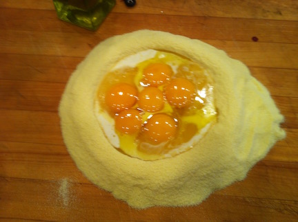
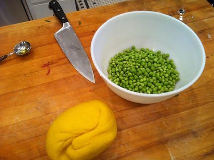
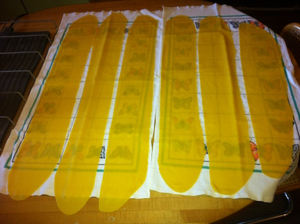
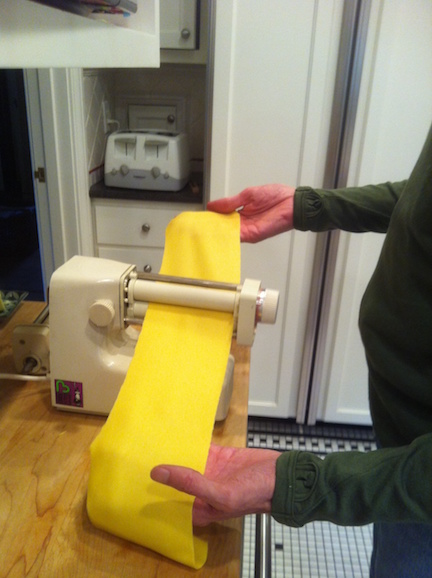
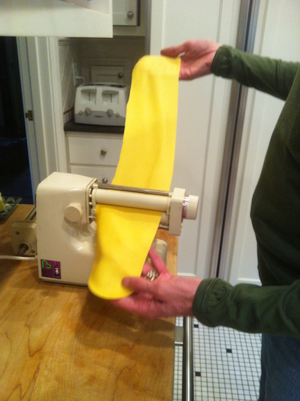
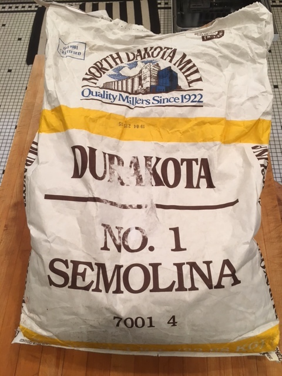

For a long time my webpage "causes" has featured a link to 
Dave Byer's page devoted to the Pavoni Europiccolo espresso machine
and related obsessive coffee matters.  I was once a devotee myself of this machine, but
I confess that at some point my attempt to accumulate -- as Byer puts it --
``karma: the sum of a person's actions in previous states of espresso, 
viewed as deciding his or her fate in future espressos.''
faltered and I've lapsed into the [naraka](
https://en.wikipedia.org/wiki/Naraka_(Buddhism))
of Saeco darkness. 

There is, however, another machine -- also Italian -- to which I owe
a semi-religious attachment, and that is the Bialetti
Elettrodomestici Macchina Per Pasta.  This is a work of true
engineering genius, perhaps not as physically beautiful as the
iconic Bialetti [Moko](https://en.wikipedia.org/wiki/Moka_pot),  
but functionally far superior.

You don't need to take my word for it, instead consider the advice of the redoubtable 
[Marcella Hazan](http://www.newyorker.com/culture/culture-desk/marcella-hazan-changed-my-life)

> There are two reasons [the Bialetti makes better pasta].  The first is speed.  
> It is dazzingly fast, and the speed at which dough is flattened is closely
> related to quality in the consistency of pasta.  The second reason is the
> material of which the rollers are made.  The hand cranked machine has smooth 
> polished steel rollers that produce the slithery surface characteristic of 
> machine-made pasta.  The electric [Bialetti] model has textured nylon rollers 
> that turn out pasta with a surface not quite so slick, almost resembling hand
> rolled pasta.

{angle="180" }

I bought one of these machines shortly after reading this passage 
when it first appeared in 1978.  Since then, by my conservative estimate, 
my Bialetti has produced about 5km of the pasta sheets shown below.

Two weeks ago, having rolled out a batch of pasta, the motor stopped.
I had dreaded this moment for years, the motor was always loud, Hazan
writes that "the machine has a maddeningly noisy motor that must have
been designed my a motorcycle enthusiast,"  but it ran, and ran, and ran.  
Now what?  Was this the end of my pasta making career?  I had always 
hoped to learn to make tortellini!   I cut the pasta sheets by hand
and wondered what to do next.

Fortunately, a neighbor recommended someone  who had fixed their Cuisineart
mixer,  I called, he came to pick it up, and a week later the motor has
new brushes, and seems to be as good as new.  Meanwhile, in a panic  I've 
acquired two other old Bialetti's via Ebay, one with metal rollers one
with the much preferable nylon rollers.

I don't know when or why Bialetti stopped making these machines, but
it is a tragedy of cosmic or at least capitalistically comic proportions.

Below you will find a quick illustrated guide to the process of pasta
making Bialetti style.  I use slightly modified version of Keller's standard recipe:  
4 large egg yolks, 2 whole eggs, a splash of milk, a splash of olive 
oil, and 2 cups of semolina flour from the 
[North Dakota State Mill and Elevator](https://en.wikipedia.org/wiki/North_Dakota_Mill_and_Elevator)
All the egg yolks make it look
yellow, but the flour makes it ideologically red.  You make a well,
pour the eggs in, mix in the flour and work into a ball.  Knead a bit
wrap in plastic, wait for half an hour, knead for another 5-10 minutes,
cut into 6 pieces and roll.  I use Bialetti setting 3 for spagetti, 
and 2 for fettucchini.

